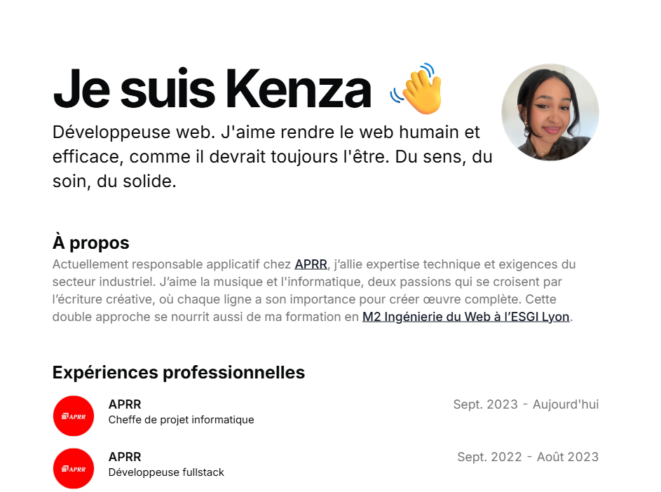

# Portfolio de Kenza Schuler

Un portfolio moderne et minimaliste développé avec Next.js, TypeScript et Tailwind CSS. Ce site présente mes projets, expériences professionnelles et compétences techniques de manière claire et esthétique.



## 🚀 Technologies utilisées

- **Framework**: [Next.js 14](https://nextjs.org/) - React avec App Router
- **Langage**: [TypeScript](https://www.typescriptlang.org/) pour la sécurité des types
- **Styles**: [Tailwind CSS](https://tailwindcss.com/) pour un design moderne et responsive
- **Composants UI**: [Radix UI](https://www.radix-ui.com/) + [Shadcn/ui](https://ui.shadcn.com/)
- **Animations**: [Framer Motion](https://www.framer.com/motion/) pour des transitions fluides
- **Icônes**: [Lucide React](https://lucide.dev/) + icônes personnalisées
- **Markdown**: [React Markdown](https://github.com/remarkjs/react-markdown) pour le contenu
- **Thème**: Support du mode sombre/clair avec [next-themes](https://github.com/pacocoursey/next-themes)

## ✨ Fonctionnalités

- **🎨 Design moderne** : Interface minimaliste et élégante
- **📱 Responsive** : Optimisé pour tous les écrans (mobile, tablette, desktop)
- **🌙 Mode sombre/clair** : Basculement automatique selon les préférences système
- **⚡ Performance** : Optimisé pour la vitesse avec Next.js
- **🔄 Animations fluides** : Transitions et effets avec Framer Motion
- **📊 Navigation intuitive** : Dock de navigation en bas de page
- **📝 Contenu dynamique** : Sections extensibles pour les expériences
- **🔗 Links sociaux** : Intégration GitHub, LinkedIn et email
- **📧 Contact facile** : Cartes de contact interactives

## 🏗️ Structure du projet

```
portfolio/
├── src/
│   ├── app/                    # App Router Next.js
│   │   ├── globals.css        # Styles globaux
│   │   ├── layout.tsx         # Layout principal
│   │   ├── page.tsx           # Page d'accueil
│   │   └── blog/              # Section blog (optionnel)
│   ├── components/            # Composants réutilisables
│   │   ├── ui/                # Composants UI de base
│   │   ├── magicui/           # Composants d'animation
│   │   ├── navbar.tsx         # Navigation
│   │   ├── resume-card.tsx    # Carte d'expérience
│   │   ├── project-card.tsx   # Carte de projet
│   │   └── theme-provider.tsx # Provider de thème
│   ├── data/
│   │   └── resume.tsx         # Données du CV et portfolio
│   └── lib/
│       └── utils.ts           # Utilitaires
├── public/                    # Assets statiques
│   ├── me.png                # Photo de profil
│   └── *.png                 # Logos des entreprises/projets
├── content/                   # Contenu Markdown (blog)
└── css/                      # Styles additionnels
```

## 🚀 Installation et développement

### Prérequis

- Node.js 18+ 
- npm, yarn ou pnpm

### Installation

1. **Cloner le repository**
```bash
git clone https://github.com/s-kenza/portfolio.git
cd portfolio
```

2. **Installer les dépendances**
```bash
npm install
# ou
yarn install
# ou
pnpm install
```

3. **Lancer le serveur de développement**
```bash
npm run dev
# ou
yarn dev
# ou
pnpm dev
```

4. **Ouvrir le navigateur**
Aller sur [http://localhost:3000](http://localhost:3000)

### Scripts disponibles

```bash
npm run dev      # Serveur de développement
npm run build    # Build de production
npm run start    # Serveur de production
npm run lint     # Linter ESLint
```

## ⚙️ Configuration

### Personnalisation du contenu

Toutes les données du portfolio sont centralisées dans `src/data/resume.tsx` :

```typescript
export const DATA = {
  name: "Votre Nom",
  description: "Votre description",
  skills: ["React", "Next.js", "TypeScript"],
  work: [
    {
      company: "Entreprise",
      title: "Poste",
      description: "Description du poste...",
      // ...
    }
  ],
  projects: [
    {
      title: "Nom du projet",
      description: "Description...",
      technologies: ["Tech1", "Tech2"],
      // ...
    }
  ],
  // ...
}
```

### Ajout d'images

Placez vos images dans le dossier `public/` et référencez-les dans `resume.tsx` :

```typescript
logoUrl: "/nom-de-votre-image.png"
```

### Modification des couleurs

Les couleurs sont définies dans `tailwind.config.ts` et `src/app/globals.css`.

## 📦 Déploiement

### Vercel (Recommandé)

1. Connecter votre repository GitHub à [Vercel](https://vercel.com)
2. Vercel détectera automatiquement Next.js et configurera le build
3. Le site sera déployé automatiquement à chaque push

### Netlify

1. Connecter votre repository à [Netlify](https://netlify.com)
2. Configurer les paramètres de build :
   - Build command: `npm run build`
   - Publish directory: `.next`

### Build manuel

```bash
npm run build
npm run start
```

## 🎨 Personnalisation avancée

### Ajouter une nouvelle section

1. Modifier `src/data/resume.tsx` pour ajouter vos données
2. Créer un nouveau composant dans `src/components/`
3. Intégrer la section dans `src/app/page.tsx`
4. Ajouter la navigation dans la navbar

### Modifier les animations

Les animations sont gérées avec Framer Motion dans `src/components/magicui/`. Vous pouvez personnaliser :
- Les délais d'apparition (`BLUR_FADE_DELAY`)
- Les transitions
- Les effets de hover

## 📄 License

Ce projet est sous licence MIT. Voir le fichier `LICENSE` pour plus de détails.

## 👤 Contact

**Kenza Schuler**
- Portfolio: [kenza-schuler.vercel.app](https://kenza-schuler.vercel.app)
- GitHub: [@s-kenza](https://github.com/s-kenza)
- LinkedIn: [kenza-schuler](https://www.linkedin.com/in/kenza-schuler-9aa4ab231/)
- Email: kenza.schuler@gmail.com

---

⭐ Si ce projet vous plaît, n'hésitez pas à lui donner une étoile sur GitHub !

   ```bash
   git clone https://github.com/dillionverma/portfolio
   ```

2. Move to the cloned directory

   ```bash
   cd portfolio
   ```

3. Install dependencies:

   ```bash
   pnpm install
   ```

4. Start the local Server:

   ```bash
   pnpm dev
   ```

5. Open the [Config file](./src/data/resume.tsx) and make changes

# License

Licensed under the [MIT license](https://github.com/dillionverma/portfolio/blob/main/LICENSE.md).
